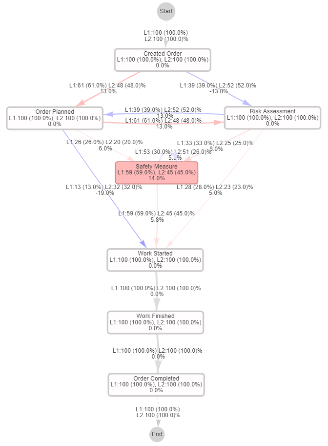

# Adapted VPC

The adapted VPC allows you to create a shared DFG of two event logs. The visualization is enriched with frequency-related information, such as the relative frequency difference and the case coverage of activities per log. 


## Prerequisites

Please install the required packages via the requirements.txt file.
```bash
  pip install -r requirements.txt
```
    
## Usage

You can find an example in the Example_Usage.iypnb. 

The adapted VPC requires two event logs and their concatenation as input:

```javascript
log_1 = pm4py.read_xes('sample_logs/sample_log_1.xes')
log_2 = pm4py.read_xes('sample_logs/sample_log_2.xes')
concatenated_log = Adapted_VPC.concat_logs(log_1, log_2, case_id_col='case:concept:name')
```

In the next step, you need to create an empty Network object. You can specify the width and height of the resulting visualization:

```javascript
nt = Network(height="1300px", width="1300px", directed=True)
```

To apply the adapted VPC procedure, use the following command:
```javascript
nt = Adapted_VPC.apply_adapted_vpc(nt, concatenated_log, log_1, log_2, name_a="A", name_b="B", frac_paths=1, show_edge_labels=True, edge_label_min=10, case_coverage_min=10)
```
You can specify the names that will be displayed for the event logs, as well as the fraction of (most frequent) paths that the DFG shows. If you don't want to visualize the edge labels, set show_edge_labels=False. With the edge_label_min and case_coverage_min parameters you can set an upper bound for the minimum relative frequency difference and case coverage of edges to be labeled. 

To display the labels, use the following code:
```javascript
nt.toggle_physics(True) # nodes should be part of physics simulation
nt.set_edge_smooth('dynamic') # edges have an invisible support node guiding the shape
nt.show_buttons() # show widgets for manipulation
nt.show('sample_output.html')
```

In the HTML file, you will find the shared DFG. You can manipulate the visualization by dragging the nodes, or changing the settings through the widgets. 



Hint: Try setting the *avoidOverlap* and *springLength* parameters in the physics section to improve the readability.

## Acknowledgements

The adapted VPC is based on the Visual Process Comparator (VPC) as proposed by T. Mazhar et al. in the paper *Stochastic-Aware Comparative Process Mining in Healthcare*.

Mazhar, T.I., Tariq, A., Leemans, S.J.J., Goel, K., Wynn, M.T., Staib, A. (2023). Stochastic-Aware Comparative Process Mining in Healthcare. In: Di Francescomarino, C., Burattin, A., Janiesch, C., Sadiq, S. (eds) Business Process Management. BPM 2023. Lecture Notes in Computer Science, vol 14159. Springer, Cham. https://doi.org/10.1007/978-3-031-41620-0_20

The original VPC implementation can be found at: https://github.com/asadTariq666/BPM-Alpha-Attribute-Selection

